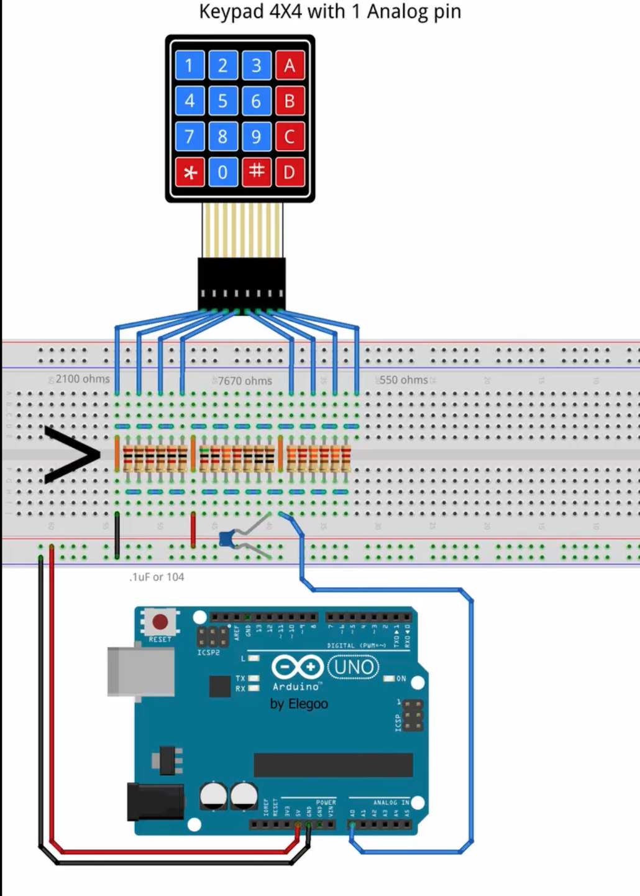
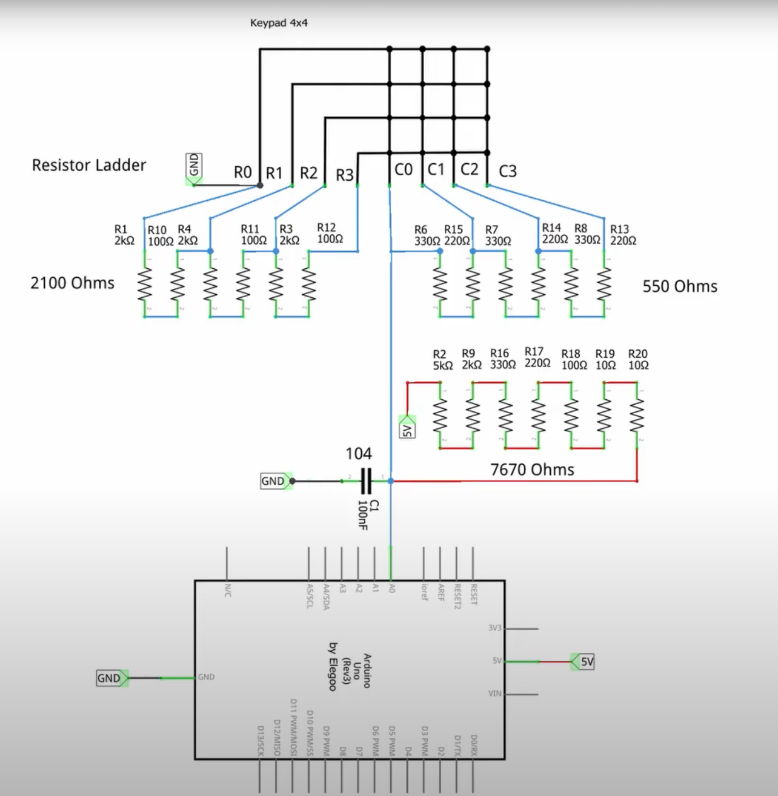
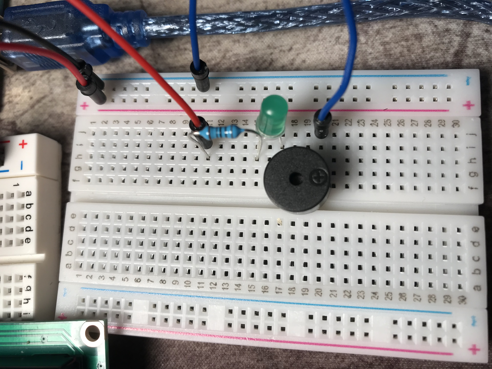

# Smart-Alarm-Clock

## INSTALL

## to install libraries: in the arduino IDE, at the top, under sketch>include library>manage libaries

### rtclib library used with the DS1307 module v03 (elegoo) real time clock

#### https://www.arduino.cc/reference/en/libraries/rtclib/

#### https://adafruit.github.io/RTClib/html/class_r_t_c___d_s1307.html

#### how to connect RTC:

#### - rtc gnd to arduino gnd

#### - rtc vcc to arduino 5V

#### - rtc sda to arduino A4

#### - rtc scl to arduino A5

#### - rtc sqw to nothing

### ---------------------------------------------------

### LiquidCrystal (for lcd) library (should already be installed)

#### https://www.arduino.cc/reference/en/libraries/liquidcrystal/

#### how to connect LCD:

#### https://docs.arduino.cc/learn/electronics/lcd-displays lists the parts

#### also make sure to turn the potentiometer to change the contrast/brightness

#### 

#### how to multiplex the 4x4 keypad:

#### 

#### 

#### buzzer/led for alarm( using another breadboard connected to the original breadboard)
#### 

### ---------------------------------------------------
